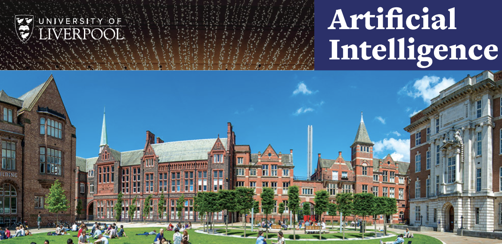

  

  
 
  
 
  

---

## Associated with nine Nobel Prize winners and consistently ranked in the top 200 universities worldwide, Liverpool is a member of the prestigious Russell Group of the UK’s leading research universities with an annual turnover of £523 million, including £95 million for research.
---

# 👋 Introduction

> My name is Muhammad Ali and I am a part-time Artificial Intelligence postgraduate at University of Liverpool. My areas of interest include deep learning networks, natural language processing and blockchain. 
> 
> For the last three years, I have worked as a data analyst in a diverse education sector. Additionally, I completed an intensive 10 weeks full stack development bootcamp (Le Wagon) last month (17th June).

**You can visit my LinkedIn profile [here](https://www.linkedin.com/in/muhammadali7/).**

# 👨‍💻 Projects

Here's a brief high-level overview of the main projects completed in the last 1.5 years (2021-22):

- Development of a generative chatbot utlising Seq-2-seq algorithms owing to their sequential learning and predictive properties; two seq-2-seq models with and without an attention layer are constructed and WikiQA dataset selected for experiments. Future work might include dropout layer integration to tackle overfitting and experimentation with token dropout to enhance data augmentation.
- Almedius is a software which solves Sudoku with the aid of genetic algorithms; in terms of comparative performance of selection strategies, roulette outperforms tournament, which in turn outperforms ranked. Future work might involve implementation of dynamic adaptation of the mutation rate and avoiding unnecessary competition by opting for a single population with a higher amount of chromosomes. 
- Development of convolutional neural network (CNN) models for pneumonia detection; SqueezeNet with an f1-score of 0.81 outperforms VGG16, DenseNet and Autokeras models; Future work might involve developing an end-to-end system for pneumonia identification with the aid of deep learning detection, segmentation and classification. Furthermore, models capable of detecting a patient's genetic predisposition to develop pneumonia should be explored with the help of relevent datasets (blood tests, sensor readings, etc).
- Development of a 2D occupancy grid map for an enviornment containing obstacles using both inverse sensor model and wandering behaviour; in terms of performance, wandering beahviour (autonomous move) covered more area in less time compared to teleoperation. Future work might involve implementing potential field, vector field histogram algorithms along with bubble band techniques to carry out comparative analysis of time taken for map generation and avoidance effiency of respective algorithms.

# ⚠️ License

MIT License

Copyright (c) 2022 Muhammad Ali

Permission is hereby granted, free of charge, to any person obtaining a copy
of this software and associated documentation files (the "Software"), to deal
in the Software without restriction, including without limitation the rights
to use, copy, modify, merge, publish, distribute, sublicense, and/or sell
copies of the Software, and to permit persons to whom the Software is
furnished to do so, subject to the following conditions:

The above copyright notice and this permission notice shall be included in all
copies or substantial portions of the Software.

THE SOFTWARE IS PROVIDED "AS IS", WITHOUT WARRANTY OF ANY KIND, EXPRESS OR
IMPLIED, INCLUDING BUT NOT LIMITED TO THE WARRANTIES OF MERCHANTABILITY,
FITNESS FOR A PARTICULAR PURPOSE AND NONINFRINGEMENT. IN NO EVENT SHALL THE
AUTHORS OR COPYRIGHT HOLDERS BE LIABLE FOR ANY CLAIM, DAMAGES OR OTHER
LIABILITY, WHETHER IN AN ACTION OF CONTRACT, TORT OR OTHERWISE, ARISING FROM,
OUT OF OR IN CONNECTION WITH THE SOFTWARE OR THE USE OR OTHER DEALINGS IN THE
SOFTWARE.

 

---

 

